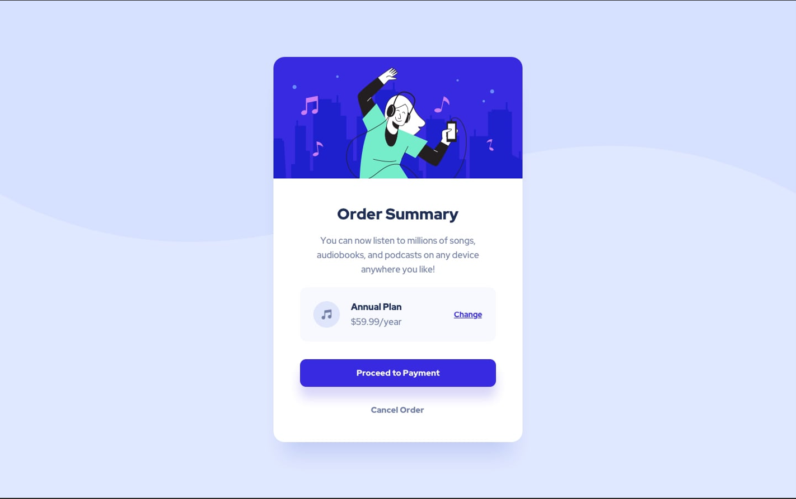

# Frontend Mentor - Order summary card solution

This is a solution to the [Order summary card challenge on Frontend Mentor](https://www.frontendmentor.io/challenges/order-summary-component-QlPmajDUj). Frontend Mentor challenges help you improve your coding skills by building realistic projects. 

## Table of contents

- [Overview](#overview)
  - [The challenge](#the-challenge)
  - [Screenshot](#screenshot)
  - [Links](#links)
- [My process](#my-process)
  - [Built with](#built-with)
  - [What I learned](#what-i-learned)
  - [Continued development](#continued-development)
  
- [Author](#author)
- [Acknowledgments](#acknowledgments)

**Note: Delete this note and update the table of contents based on what sections you keep.**

## Overview

### The challenge

Users should be able to:

- See hover states for interactive elements

### Screenshot

.

### Links

- Solution URL: [Add solution URL here](https://tguruteja.github.io/frountend_mentor_Summer_card/)
- Live Site URL: [Add live site URL here](https://tguruteja.github.io/frountend_mentor_Summer_card/)

## My process

### Built with

- Semantic HTML5 markup
- CSS custom properties

### What I learned

As it's is my first frountend desine,It felt little nerves, But I tryed my best to get closer to solution.
I improved my understanding ability how HTML and CSS work in real time.

If you want more help with writing markdown, we'd recommend checking out [The Markdown Guide](https://www.markdownguide.org/) to learn more.

**Note: Delete this note and the content within this section and replace with your own learnings.**

### Continued development

As this is a start, It take's somr time to learn things. But I enjoy developing and I will improve my skills in development.

## Author

- Website - [Guru Teja]
- Frontend Mentor - [@TGuruteja](https://www.frontendmentor.io/profile/TGURUTEJA)
- Linked IN - [@Guruteja](https://www.linkedin.com/in/guru-teja-thondamanadu-26176b210/)

